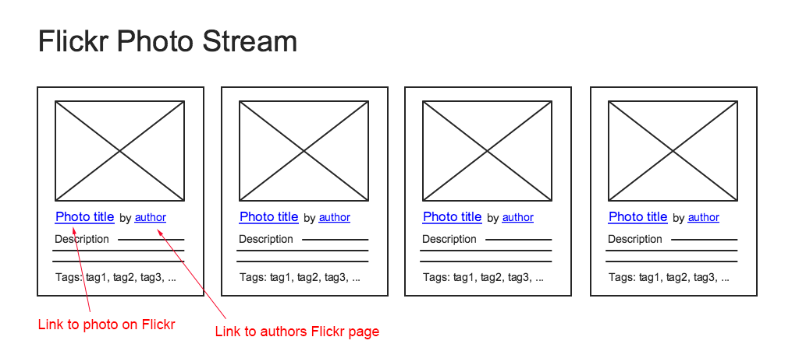

# Web Development Flickr Task

**Your task is to consume the public [Flickr API](https://api.flickr.com/services/feeds/photos_public.gne?format=json) and display the results according to this basic wireframe:**

> 

We would expect this task to take a few hours, however there is no strict time limit and you won't be judged on how long it took you to complete.

Your solution _must_:

- Function as a [single page app](http://en.wikipedia.org/wiki/Single-page_application).
- Use HTML and CSS (using pre-compilers such as LESS and Sass or CSS-in-JS is fine).
- Use JavaScript. We would recommend using a framework like React (preferred), VueJS or AngularJS to speed up development time, but you are welcome to use vanilla JavaScript as well.
- Support the major browsers (Chrome, Firefox, Safari, IE10+).
- Be [responsive](https://web.dev/responsive-web-design-basics/).
- Have infinite scroll (loading more images as you scroll).
- Have a search function based on tags, title and / or description.
- Have (partial or full) test coverage.
- Use the `safe_search` parameter. 

Although the main outcomes of the task are listed above, if you feel like you want to go that extra mile and show us what you're capable of, here is a list of potential enhancements that we have come up with:

- Think about how you might improve the speed or performance of the page. For example lazy loading the images.
- Enhance the `safe_search`.
- Animations to enhance the user experience, for example a loading icon.

Alternatively if you can think of any other features that you feel would further enhance your app, then we'd love to see what you can come up with!

React is our technology of choice for front end development, therefore we would like you to use it for this task.

However you are free to use any other framework that you feel comfortable with, and present your work in the best possible light.

You can use a bootstrap tool like create-react-app to speed up the development process.

If you do decide to use other Flickr API feeds to show us what you can do, be aware that some endpoints do require an API key. You can apply for your own [here](https://www.flickr.com/services/api/keys)..
